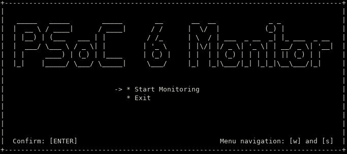
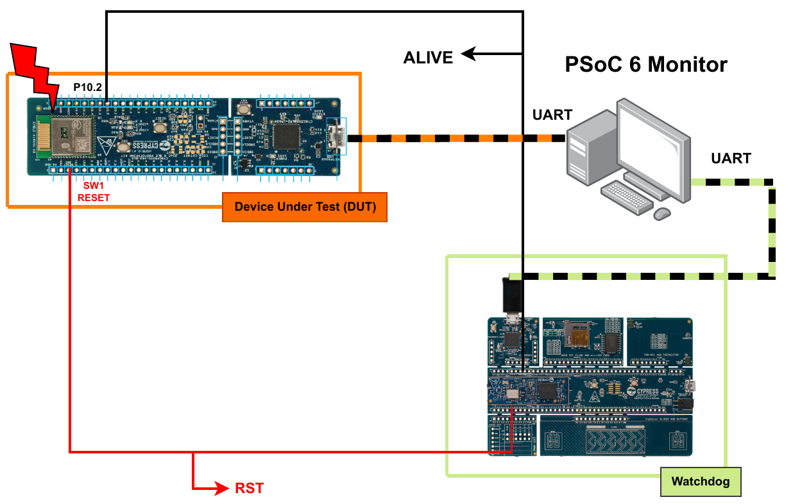

# PSoC 6 Monitor (Monitoring Software)

This repository is part of my Graduation Project in Electrical Engineering, titled ["Radiation Fault Detection System for SEE in a Mixed-signal Programmable SOC"](doc/graduation_thesis.pdf).

The monitoring software, responsible for the automation of tests by managing the system devices, is entirely developed in C using an ASCII interface to interact with the user. This way, it is simple enough to be executed on any computer running either a Windows or Linux OS.

**Figure 1. Initial menu**



## Compilation

### Linux:

```bash
make
```

### Windows:

Using MinGW, execute "windows\_build.bat"

## Monitoring System

The objective of my graduation project was to develop a fault monitoring system
in order to identify soft errors in a commercial off-the-shelf (COTS) device (PSoC 6 from Infineon).

The proposed system, illustrated in Figure 2, is essentially composed of three elements: the main device or
device under test, in this case the SOC that will be operating in a radiation environment or under
a particle accelerator beam; a second device, which will act as an external watchdog for the main
device and serve as an auxiliary driver; and finally, a monitoring computer program, which will
manage both devices, coordinate log acquisition and automate the monitoring process.

A fully description of how the system works starts at page 47.

**Figure 2. Monitoring system**



## System Repositories

* [Main device (DUT)](https://github.com/eduardofabbris/error_detection)

* [External Watchdog](https://github.com/eduardofabbris/external_watchdog)

* [Monitoring Software](https://github.com/eduardofabbris/psoc_monitor)

## How to Plot a Buffer Using Python

Be sure to have all libraries needed (e.g. matplotlib) and initialize interactive python inside
the repository, where plot_buffer.py file can be found.

```bash
python3
```

Load LogProcessor class.

```bash
>>> from plot_buffer import LogProcessor
```

```bash
>>> c = LogProcessor('report/example_log.txt')
```

Load and plot a new buffer.

```bash
>>> c.load_new_buffer(2)
```

```bash
>>> c.plot_buffer()
```
